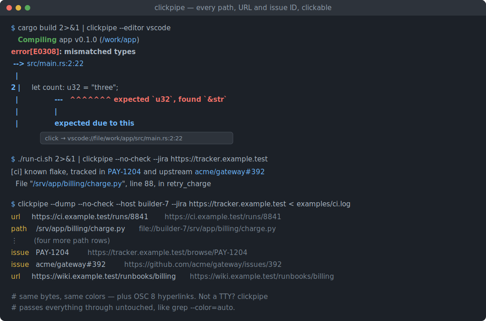
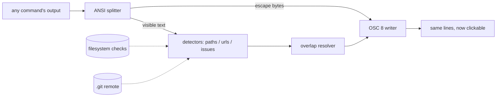

# clickpipe

[English](README.md) | [中文](README.zh.md) | [日本語](README.ja.md)

[](LICENSE) [](Cargo.toml)  [](CONTRIBUTING.md)

**オープンソースのパイプフィルタ：任意のコマンド出力に含まれるファイルパス・URL・issue 番号をクリック可能なターミナルハイパーリンクに変換——パイプ 1 本で、ツールごとの統合もターミナル固有の設定も不要。**



```bash
git clone https://github.com/JaydenCJ/clickpipe.git && cargo install --path clickpipe
```

## なぜ clickpipe？

ターミナルは本物のハイパーリンク（OSC 8）を何年も前からサポートしています——iTerm2、WezTerm、kitty、Alacritty、foot、GNOME Terminal、Windows Terminal のどれもレンダリングできます——しかし出力する側はほぼ皆無：`ls --hyperlink` と `gcc -fdiagnostics-urls` が数少ない例外で、コンパイラもテストランナーも CI ログも今なお死んだテキストを吐きます。既存の回避策はパイプの間違った側にあります：kitty hints、WezTerm rules、iTerm2 Smart Selection はターミナルごとの設定で、正規表現の当て推量に頼り、作業ディレクトリもエディタも issue トラッカーも知りません；ピッカー系ツールはセッションの末尾に選択 UI を丸ごとぶら下げます。clickpipe はフィルタです：`cargo build 2>&1 | clickpipe` はツールが印字した全バイトを——色もそのまま——再送出しつつ、`src/main.rs:14:9` を 14 行目でエディタが開くハイパーリンクに包み、URL をクリック可能にし、`#123` をリポジトリ自身の git remote 経由でトラッカーへ解決します。リンク化の前にパスをファイルシステムで検証し、既存のハイパーリンクを二重に包むことはなく、stdout がターミナルでなければバイト単位でそのまま通します。

|  | clickpipe | ターミナル hint 規則¹ | ツール別フラグ² | ピッカー系ツール³ |
|---|---|---|---|---|
| 任意のコマンド出力に効く | はい——パイプそのもの | はい | いいえ、対応ツールのみ | はい |
| どの OSC 8 ターミナルでも動く | はい、素のエスケープ列 | いいえ、端末ごとの設定 | はい | 対象外（独自 UI） |
| パスをファイルシステムで検証 | はい（デフォルト） | いいえ、正規表現の推測 | 対象外 | 部分的 |
| 行・列番号をエディタへ引き継ぐ | はい（`--editor`） | 部分的 | いいえ | はい |
| issue 番号を git remote から解決 | はい | いいえ | いいえ | いいえ |
| 出力レイアウトと色を保持 | はい | はい | はい | いいえ、別 UI |
| ターゲットを開く操作コスト | クリック 1 回 | hint モードのキー操作 | クリック 1 回 | ピッカー 1 往復 |
| ランタイム依存 | ゼロ（std のみ） | — | — | まちまち |

<sub>¹ kitty hints kitten、WezTerm hyperlink_rules、iTerm2 Smart Selection。² `ls --hyperlink`、`gcc -fdiagnostics-urls`、`delta --hyperlinks`。³ urlview/urlscan、Facebook PathPicker。比較は 2026-07 時点；どれも良いツールです——要点は、フィルタならそれら全部と組み合わせられ、どれの設定も要らないことです。</sub>

## 特徴

- **どのツールもパイプ 1 本** — 素の stdin→stdout フィルタとして `cargo`、`make`、`pytest`、`grep -n`、`tsc`、コンテナログに効く；プラグインもラッパーもシェル統合も不要。
- **ANSI セーフな書き換え** — 検出は可視テキスト上で行うため、色コードで分断されたパスもマッチ；SGR シーケンスは無傷で通し、既存ハイパーリンク（`ls --hyperlink`）は決して二重に包まない。
- **クリックでエディタに着地** — `--editor vscode|cursor|zed|idea|subl|txmt`（またはカスタム `{path}:{line}` テンプレート）が `main.rs:14:9` を 14 行 9 列へのディープリンクに；デフォルトはホスト名付き `file://` URI。
- **リポジトリを知る issue 番号** — `#123` は周囲の git リポジトリの `origin` remote 経由でトラッカーへ（scp/ssh/https 記法、GitLab レイアウト、worktree 対応）；`owner/repo#123` とオプトインの Jira `KEY-123` も解決。
- **誤検出への徹底した忌避** — パス候補はデフォルトでディスク上に実在することが必須（他所のログには `--no-check`）；`and/or`、`1.2.3`、`#a1b2c3` は決してリンク化しない。規則は [docs/detection.md](docs/detection.md)。
- **スクリプト内でも安全** — `--when auto` は stdout がターミナルでなければバイト単位で素通し（`grep --color=auto` と同じ流儀）；不正な UTF-8 行はそのまま転送；行ごとの flush でライブ出力に遅延ゼロ。
- **依存ゼロ、I/O の不意打ちゼロ** — std のみの Rust；読むのは指定ディレクトリと `.git/config` だけ、書くのは stdout だけ、ネットワークには一切触れない。

## クイックスタート

インストール（Rust 1.75+ が必要）：

```bash
git clone https://github.com/JaydenCJ/clickpipe.git && cargo install --path clickpipe
```

失敗したビルドをパイプに通す——出力の見た目は同一ですが、OSC 8 ターミナルではパスがリンクになり、クリックでエディタが正確な位置を開きます：

```bash
cargo build 2>&1 | clickpipe --editor vscode
```

エスケープバイトを凝視せずに検出結果を見るには、`--dump` がリンクごとに `kind, text, target` を 1 行ずつ印字します。実際にキャプチャした出力：

```text
$ cargo build 2>&1 | clickpipe --dump --host devbox
path	/work/app	file://devbox/work/app
path	src/main.rs:2:22	file://devbox/work/app/src/main.rs
```

別マシン由来の CI ログの場合（パスがローカルに無いので `--no-check`；`#218` はこのリポジトリの git remote で解決、原文のままキャプチャ）：

```text
$ clickpipe --dump --no-check --host devbox < ci.log
path	tests/test_api.py:41	file://devbox/work/app/tests/test_api.py
url	https://wiki.example.test/oncall	https://wiki.example.test/oncall
issue	#218	https://github.com/acme/app/issues/218
```

すぐ試せるログ 2 本（色付き rustc エラーと多言語 CI 失敗）は [examples/](examples/README.md) にあります。

## オプション

デフォルトは素の `| clickpipe` が常に安全であるように選んであり、それ以外はすべてオプトインです。

| キー | デフォルト | 効果 |
|---|---|---|
| `--when` | `auto` | ハイパーリンクの出力：`always`、`never`、または stdout がターミナルのときのみ |
| `--editor` | `file://` リンク | ファイルリンクをエディタで開く（`vscode`、`zed`、`idea` など、または `{path}` テンプレート） |
| `--cwd` | プロセスの cwd | 相対パスと git 探索の基準ディレクトリ |
| `--host` | このマシン | `file://` URI に埋め込むホスト名（ビルドホストのログに有用） |
| `--issues` | git から導出 | 素の `#123` 用の `{id}` テンプレート；自動探索を上書き |
| `--repo` | — | GitHub issues テンプレートの `owner/name` 省略記法 |
| `--jira` | オフ | `KEY-123` を `BASE/browse/KEY-123` にリンクするベース URL |
| `--forge` | `https://github.com` | クロスリポジトリ `owner/repo#123` 参照のベース |
| `--no-git` | 探索オン | 周囲の `.git/config` から `#123` テンプレートを導出しない |
| `--no-check` | 検証オン | ローカルに実在しなくてもパス形状のトークンをリンク化 |
| `--no-files` / `--no-urls` / `--no-issues` | 全オン | 検出器クラスを無効化 |
| `--dump` | オフ | ストリームを書き換えず `kind<TAB>text<TAB>target` 行を印字 |
| `--stats` | オフ | 入力終端で stderr にサマリ 1 行 |

## 検証

このリポジトリは CI を持ちません；上記の主張はすべてローカル実行で検証されます：`cargo test`（ユニットテスト 70 件 + CLI 統合テスト 19 件、オフラインかつ決定的）と `bash scripts/smoke.sh`——バイナリをビルドし、実物の色付きコンパイルログをパイプに通し、OSC 8 の正確なバイト列、エディタ・トラッカーリンク、素通し保証、終了コードを逐一アサートします——`SMOKE OK` を印字しなければなりません。

## アーキテクチャ



## ロードマップ

- [x] コアフィルタ：ANSI 認識の行モデル、実在チェック付きパス/URL/issue 検出器、git remote による issue 探索、エディタリンクスキーム、`--dump`/`--stats`、バイト同一の素通し
- [ ] Windows ドライブレターパスと PowerShell スタックトレース
- [ ] 設定ファイル（`~/.config/clickpipe/config.toml`）でプロジェクト別のエディタ・トラッカー指定
- [ ] コミットハッシュ検出と forge のコミットビューへのリンク
- [ ] ターミナル側の規約が固まり次第、列番号付き `file://` フラグメント対応

全リストは [open issues](https://github.com/JaydenCJ/clickpipe/issues) を参照。

## コントリビュート

コントリビュート歓迎です——[CONTRIBUTING.md](CONTRIBUTING.md) を読み、[good first issue](https://github.com/JaydenCJ/clickpipe/issues?q=is%3Aissue+is%3Aopen+label%3A%22good+first+issue%22) から始めるか、[discussion](https://github.com/JaydenCJ/clickpipe/discussions) を立ててください。

## ライセンス

[MIT](LICENSE)
