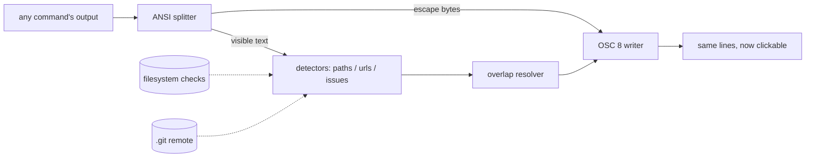

# clickpipe

[English](README.md) | [中文](README.zh.md) | [日本語](README.ja.md)

[](LICENSE) [](Cargo.toml)  [](CONTRIBUTING.md)

**Open-source pipe filter that turns file paths, URLs and issue IDs in any command's output into clickable terminal hyperlinks — one pipe, no per-tool integration, no terminal-specific config.**


```bash
git clone https://github.com/JaydenCJ/clickpipe.git && cargo install --path clickpipe
```

## Why clickpipe?

Terminals have supported real hyperlinks (OSC 8) for years — iTerm2, WezTerm, kitty, Alacritty, foot, GNOME Terminal, Windows Terminal all render them — yet almost nothing emits them: `ls --hyperlink` and `gcc -fdiagnostics-urls` are the rare exceptions, and your compiler, test runner and CI log printer still produce dead text. The existing workarounds sit on the wrong side of the pipe: kitty hints, WezTerm rules and iTerm2 Smart Selection are per-terminal configuration that guesses with regexes and knows nothing about your working directory, your editor, or your issue tracker; picker tools bolt a whole selection UI onto the end of your session. clickpipe is a filter: `cargo build 2>&1 | clickpipe` re-emits every byte your tool printed — colors intact — with `src/main.rs:14:9` wrapped in a hyperlink that opens your editor at line 14, URLs made clickable, and `#123` resolved to your tracker via the repository's own git remote. It checks paths against the filesystem before linking, never double-wraps existing hyperlinks, and passes output through byte-identically when stdout is not a terminal.

|  | clickpipe | terminal hint rules¹ | per-tool flags² | picker tools³ |
|---|---|---|---|---|
| Works on any command's output | yes — it is a pipe | yes | no, only tools that opt in | yes |
| Works in any OSC 8 terminal | yes, plain escape codes | no, per-terminal config | yes | n/a (own UI) |
| Paths verified against the filesystem | yes (default) | no, regex guesses | n/a | partially |
| Line/column carried into the editor | yes (`--editor`) | partially | no | yes |
| Issue IDs resolved from the git remote | yes | no | no | no |
| Output layout and colors preserved | yes | yes | yes | no, separate UI |
| Interaction cost to open a target | a click | hint-mode keystrokes | a click | a picker session |
| Runtime dependencies | zero (std-only) | — | — | varies |

<sub>¹ kitty hints kitten, WezTerm hyperlink_rules, iTerm2 Smart Selection. ² `ls --hyperlink`, `gcc -fdiagnostics-urls`, `delta --hyperlinks`. ³ urlview/urlscan, Facebook PathPicker. Comparison as of 2026-07; these are good tools — the point is that a filter composes with all of them and configures none of them.</sub>

## Features

- **Any tool, one pipe** — works as a plain stdin→stdout filter on `cargo`, `make`, `pytest`, `grep -n`, `tsc`, container logs; no plugins, no wrappers, no shell integration.
- **ANSI-safe rewriting** — detection runs on the visible text, so paths split by color codes still match; SGR sequences pass through untouched and pre-existing hyperlinks (`ls --hyperlink`) are never double-wrapped.
- **Clicks land in your editor** — `--editor vscode|cursor|zed|idea|subl|txmt` (or a custom `{path}:{line}` template) turns `main.rs:14:9` into a deep link at line 14, column 9; the default is a `file://` URI with the machine's hostname.
- **Issue IDs that know your repo** — `#123` links to your tracker via the `origin` remote of the surrounding git repository (scp/ssh/https syntax, GitLab layouts, worktrees); `owner/repo#123` and opt-in Jira `KEY-123` also resolve.
- **False-positive averse** — path candidates must exist on disk by default (`--no-check` for foreign logs); `and/or`, `1.2.3` and `#a1b2c3` never linkify. Rules: [docs/detection.md](docs/detection.md).
- **Safe in scripts** — `--when auto` passes bytes through untouched when stdout is not a terminal (like `grep --color=auto`); invalid UTF-8 lines are forwarded verbatim; per-line flushing adds no latency to live output.
- **Zero dependencies, zero I/O surprises** — std-only Rust; reads the tree you point it at and `.git/config`, writes to stdout, and never touches the network.

## Quickstart

Install (requires Rust 1.75+):

```bash
git clone https://github.com/JaydenCJ/clickpipe.git && cargo install --path clickpipe
```

Pipe a failing build through it — the output looks identical, but in an OSC 8 terminal the path is now a link that opens your editor at the exact spot:

```bash
cargo build 2>&1 | clickpipe --editor vscode
```

To see what was detected without squinting at escape bytes, `--dump` prints one `kind, text, target` row per link. Real captured output:

```text
$ cargo build 2>&1 | clickpipe --dump --host devbox
path	/work/app	file://devbox/work/app
path	src/main.rs:2:22	file://devbox/work/app/src/main.rs
```

And a CI log from another machine (paths don't exist locally, so `--no-check`; `#218` resolves through this repo's git remote, captured verbatim):

```text
$ clickpipe --dump --no-check --host devbox < ci.log
path	tests/test_api.py:41	file://devbox/work/app/tests/test_api.py
url	https://wiki.example.test/oncall	https://wiki.example.test/oncall
issue	#218	https://github.com/acme/app/issues/218
```

Two ready-made logs to try (a colored rustc error and a polyglot CI failure) live in [examples/](examples/README.md).

## Options

Defaults are chosen so that bare `| clickpipe` is always safe; everything else is opt-in.

| Key | Default | Effect |
|---|---|---|
| `--when` | `auto` | Emit hyperlinks `always`, `never`, or only when stdout is a terminal |
| `--editor` | `file://` links | Open file links in an editor (`vscode`, `zed`, `idea`, ..., or a `{path}` template) |
| `--cwd` | process cwd | Directory that relative paths and git discovery resolve against |
| `--host` | this machine | Hostname embedded in `file://` URIs (useful for logs from a build host) |
| `--issues` | git-derived | Template with `{id}` for bare `#123` refs; overrides discovery |
| `--repo` | — | `owner/name` shorthand for the GitHub issues template |
| `--jira` | off | Base URL that links `KEY-123` to `BASE/browse/KEY-123` |
| `--forge` | `https://github.com` | Base for cross-repo `owner/repo#123` refs |
| `--no-git` | discovery on | Do not derive the `#123` template from the surrounding `.git/config` |
| `--no-check` | check on | Link path-shaped tokens even if they do not exist locally |
| `--no-files` / `--no-urls` / `--no-issues` | all on | Disable a detector class |
| `--dump` | off | Print `kind<TAB>text<TAB>target` rows instead of rewriting the stream |
| `--stats` | off | One summary line to stderr at end of input |

## Verification

This repository ships no CI; every claim above is verified by local runs: `cargo test` (70 unit tests + 19 CLI integration tests, offline and deterministic) and `bash scripts/smoke.sh`, which builds the binary, pipes a real colored compiler log through it and asserts on the exact OSC 8 byte sequences, editor and tracker links, passthrough guarantees and exit codes — it must print `SMOKE OK`.

## Architecture



## Roadmap

- [x] Core filter: ANSI-aware line model, path/URL/issue detectors with existence checks, git-remote issue discovery, editor link schemes, `--dump`/`--stats`, byte-identical passthrough
- [ ] Windows drive-letter paths and PowerShell stack traces
- [ ] Config file (`~/.config/clickpipe/config.toml`) for per-project editors and trackers
- [ ] Commit-hash detection linking to the forge's commit view
- [ ] Column-aware `file://` fragments once terminals agree on a convention

See the [open issues](https://github.com/JaydenCJ/clickpipe/issues) for the full list.

## Contributing

Contributions are welcome — see [CONTRIBUTING.md](CONTRIBUTING.md), start with a [good first issue](https://github.com/JaydenCJ/clickpipe/issues?q=is%3Aissue+is%3Aopen+label%3A%22good+first+issue%22) or open a [discussion](https://github.com/JaydenCJ/clickpipe/discussions).

## License

[MIT](LICENSE)
