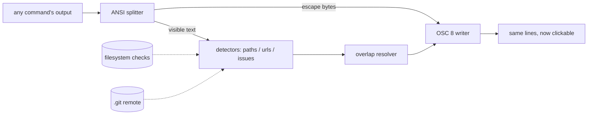

# clickpipe

[English](README.md) | [中文](README.zh.md) | [日本語](README.ja.md)

[](LICENSE) [](Cargo.toml)  [](CONTRIBUTING.md)

**开源管道过滤器：把任意命令输出中的文件路径、URL 和 issue 编号变成可点击的终端超链接——一条管道，无需逐工具集成，也无需针对特定终端做配置。**


```bash
git clone https://github.com/JaydenCJ/clickpipe.git && cargo install --path clickpipe
```

## 为什么选 clickpipe？

终端支持真正的超链接（OSC 8）已经很多年了——iTerm2、WezTerm、kitty、Alacritty、foot、GNOME Terminal、Windows Terminal 都能渲染——但几乎没有工具真的输出它：`ls --hyperlink` 和 `gcc -fdiagnostics-urls` 是罕见的例外，你的编译器、测试框架和 CI 日志打印的仍是死文本。现有的变通方案都站在管道错误的一侧：kitty hints、WezTerm rules、iTerm2 Smart Selection 是逐终端的配置，靠正则瞎猜，完全不知道你的工作目录、编辑器或 issue 跟踪器；选择器类工具则把整套挑选 UI 拖到会话末尾。clickpipe 是一个过滤器：`cargo build 2>&1 | clickpipe` 原样重发工具打印的每一个字节——颜色不动——同时把 `src/main.rs:14:9` 包成能在第 14 行打开编辑器的超链接，URL 变得可点，`#123` 通过仓库自己的 git remote 解析到你的跟踪器。它在建链前会对照文件系统校验路径，绝不重复包裹已有超链接，stdout 不是终端时按字节原样透传。

|  | clickpipe | 终端 hint 规则¹ | 逐工具开关² | 选择器工具³ |
|---|---|---|---|---|
| 对任意命令的输出生效 | 是——它就是一条管道 | 是 | 否，只有主动支持的工具 | 是 |
| 在任意 OSC 8 终端可用 | 是，纯转义序列 | 否，逐终端配置 | 是 | 不适用（自带 UI） |
| 路径对照文件系统校验 | 是（默认） | 否，正则猜测 | 不适用 | 部分 |
| 行号/列号带进编辑器 | 是（`--editor`） | 部分 | 否 | 是 |
| issue 编号按 git remote 解析 | 是 | 否 | 否 | 否 |
| 保留输出排版与颜色 | 是 | 是 | 是 | 否，独立 UI |
| 打开目标的交互成本 | 一次点击 | hint 模式按键 | 一次点击 | 一轮挑选 |
| 运行时依赖 | 零（仅 std） | — | — | 不一 |

<sub>¹ kitty hints kitten、WezTerm hyperlink_rules、iTerm2 Smart Selection。² `ls --hyperlink`、`gcc -fdiagnostics-urls`、`delta --hyperlinks`。³ urlview/urlscan、Facebook PathPicker。对比截至 2026-07；它们都是好工具——重点在于过滤器能与它们全部组合，却不需要配置其中任何一个。</sub>

## 特性

- **任意工具，一条管道** — 作为纯 stdin→stdout 过滤器作用于 `cargo`、`make`、`pytest`、`grep -n`、`tsc`、容器日志；没有插件、没有包装器、没有 shell 集成。
- **ANSI 安全改写** — 检测在可见文本上进行，被颜色码切开的路径照样匹配；SGR 序列原样透传，已有超链接（`ls --hyperlink`）绝不重复包裹。
- **点击直达编辑器** — `--editor vscode|cursor|zed|idea|subl|txmt`（或自定义 `{path}:{line}` 模板）把 `main.rs:14:9` 变成第 14 行第 9 列的深链接；默认是带主机名的 `file://` URI。
- **懂你仓库的 issue 编号** — `#123` 通过所在 git 仓库的 `origin` remote 链接到你的跟踪器（scp/ssh/https 语法、GitLab 布局、worktree 均可）；`owner/repo#123` 与可选的 Jira `KEY-123` 同样解析。
- **极力避免误报** — 路径候选默认必须真实存在于磁盘（外来日志用 `--no-check`）；`and/or`、`1.2.3`、`#a1b2c3` 永远不会成链。规则详见 [docs/detection.md](docs/detection.md)。
- **脚本中安全** — `--when auto` 在 stdout 不是终端时按字节透传（同 `grep --color=auto`）；非法 UTF-8 行原样转发；逐行刷新，对实时输出零延迟。
- **零依赖、零 I/O 意外** — 纯 std Rust；只读你指定的目录树和 `.git/config`，只写 stdout，绝不碰网络。

## 快速上手

安装（需要 Rust 1.75+）：

```bash
git clone https://github.com/JaydenCJ/clickpipe.git && cargo install --path clickpipe
```

把一次失败的构建接进管道——输出看起来一模一样，但在 OSC 8 终端里路径已是链接，点击即在编辑器中打开精确位置：

```bash
cargo build 2>&1 | clickpipe --editor vscode
```

想看检测结果而不必盯转义字节，`--dump` 会为每个链接打印一行 `kind, text, target`。真实捕获的输出：

```text
$ cargo build 2>&1 | clickpipe --dump --host devbox
path	/work/app	file://devbox/work/app
path	src/main.rs:2:22	file://devbox/work/app/src/main.rs
```

再看一份来自其他机器的 CI 日志（路径本地不存在，故用 `--no-check`；`#218` 通过本仓库的 git remote 解析，原样捕获）：

```text
$ clickpipe --dump --no-check --host devbox < ci.log
path	tests/test_api.py:41	file://devbox/work/app/tests/test_api.py
url	https://wiki.example.test/oncall	https://wiki.example.test/oncall
issue	#218	https://github.com/acme/app/issues/218
```

[examples/](examples/README.md) 里备好两份现成日志（带色 rustc 报错和一份多语言 CI 故障）供直接试跑。

## 选项

默认值的取向是让裸 `| clickpipe` 永远安全；其余一切均为可选项。

| 键 | 默认值 | 效果 |
|---|---|---|
| `--when` | `auto` | 超链接输出时机：`always`、`never`，或仅当 stdout 是终端 |
| `--editor` | `file://` 链接 | 文件链接改在编辑器打开（`vscode`、`zed`、`idea` 等，或 `{path}` 模板） |
| `--cwd` | 进程 cwd | 相对路径与 git 发现所基于的目录 |
| `--host` | 本机 | 嵌入 `file://` URI 的主机名（对构建机日志很有用） |
| `--issues` | git 推导 | 裸 `#123` 的 `{id}` 模板；覆盖自动发现 |
| `--repo` | — | GitHub issues 模板的 `owner/name` 简写 |
| `--jira` | 关 | 把 `KEY-123` 链接到 `BASE/browse/KEY-123` 的基址 |
| `--forge` | `https://github.com` | 跨仓库 `owner/repo#123` 引用的基址 |
| `--no-git` | 发现开 | 不从周围的 `.git/config` 推导 `#123` 模板 |
| `--no-check` | 校验开 | 路径形状的 token 即使本地不存在也建链 |
| `--no-files` / `--no-urls` / `--no-issues` | 全开 | 关闭某类检测器 |
| `--dump` | 关 | 打印 `kind<TAB>text<TAB>target` 行，而非改写流 |
| `--stats` | 关 | 输入结束时向 stderr 打一行汇总 |

## 验证

本仓库不带 CI；上述每一条主张都由本地运行验证：`cargo test`（70 个单元测试 + 19 个 CLI 集成测试，离线且确定性）以及 `bash scripts/smoke.sh`——它构建二进制、把真实带色编译日志接进管道，并对精确的 OSC 8 字节序列、编辑器与跟踪器链接、透传保证和退出码逐一断言——必须打印 `SMOKE OK`。

## 架构



## 路线图

- [x] 核心过滤器：ANSI 感知行模型、带存在性校验的路径/URL/issue 检测器、git remote issue 发现、编辑器链接方案、`--dump`/`--stats`、字节级透传
- [ ] Windows 盘符路径与 PowerShell 堆栈跟踪
- [ ] 配置文件（`~/.config/clickpipe/config.toml`）：按项目设定编辑器与跟踪器
- [ ] 提交哈希检测，链接到 forge 的 commit 视图
- [ ] 待终端就约定达成一致后，支持带列号的 `file://` 片段

完整列表见 [open issues](https://github.com/JaydenCJ/clickpipe/issues)。

## 参与贡献

欢迎贡献——请看 [CONTRIBUTING.md](CONTRIBUTING.md)，从 [good first issue](https://github.com/JaydenCJ/clickpipe/issues?q=is%3Aissue+is%3Aopen+label%3A%22good+first+issue%22) 入手，或发起一个 [discussion](https://github.com/JaydenCJ/clickpipe/discussions)。

## 许可证

[MIT](LICENSE)
